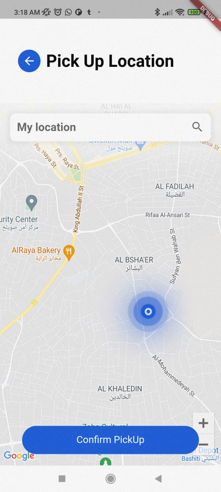
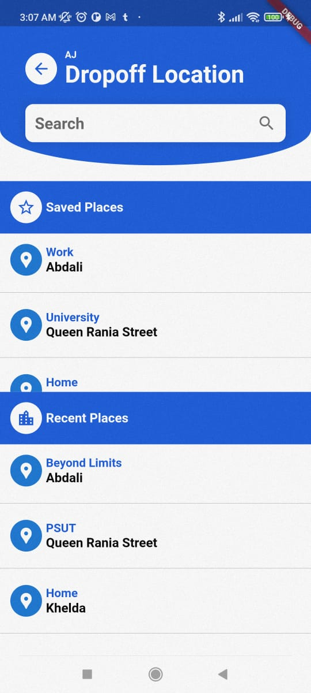
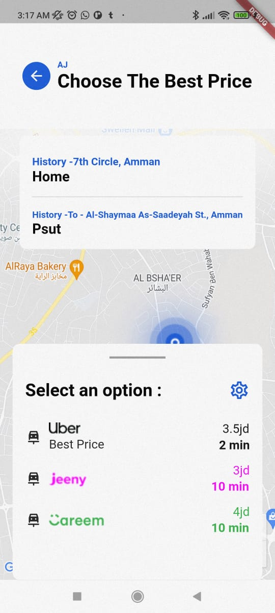
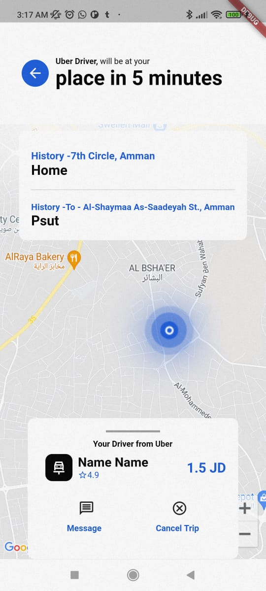

On the way is a cross-platform all-in-one application enabling users to seamlessly compare and access multiple ride-sharing platforms.

Skills:
Founded and developed using Flutter a cross-platform all-in-one application enabling users to seamlessly compare and access multiple ride-sharing platforms.
Created a user-friendly interface for the all-in-one application that was specifically curated alongside the design team to efficiently target various demographics.
Entrepreneurially organized and built a team that developed the all-in-one application
and pitched it to investors.

  

  

